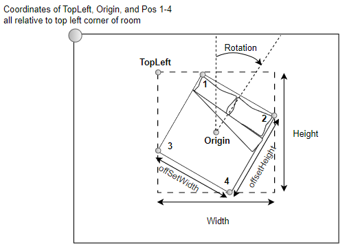

# Room-Arranger

### Docker Commands (run in ra-react-app directory)

```
## Re-build whenever you install new packages or merge other team member's commits 
docker build --tag ra-img .
```

```
## Run whenever you start development
docker run -it --rm -v ${PWD}:/app -v /app/node_modules -p 3000:3000 -e CHOKIDAR_USEPOLLING=true ra-img
```

### JSON Data Diagram



Example JSON
```
{
  "room" : {
    "dimensions" : [160, 180]
  },

  "furniture" : [
    {
      "type": "bed",
      "position": {
        "width": 75,
        "height": 75,
        "offSetWidth": 60,
        "offSetHeight": 80,
        "topleft": [200, 200],
        "pos1": [,],
        "pos2": [,],
        "pos3": [,],
        "pos4": [,],
        "origin": [,],
      }
    },
    {
      "type": "desk",
      "position": {

      }
    }
  ],
  
  "doors": [
    {
      "type": "exit",
      "position": {
        //same format as furniture
      }
    },
  ]
}
```
