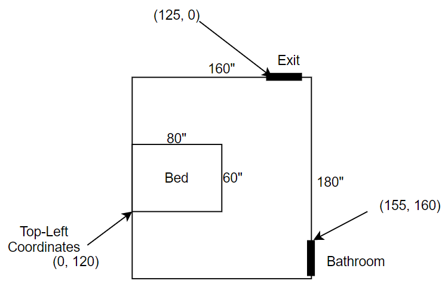

# Room-Arranger

### Docker Commands (run in ra-react-app directory)

```
## Re-build whenever you install new packages or merge other team member's commits 
docker build --tag ra-img .
```

```
## Run whenever you start development
docker run -it --rm -v ${PWD}:/app -v /app/node_modules -p 3000:3000 -e CHOKIDAR_USEPOLLING=true ra-img
```

### JSON Format



dimensions: [Width, Height]    
coordinates: [TopLeft-X, TopLeft-Y]     
Heading: How much the object is rotated clockwise in degrees. Range 0-360.     

Important: Width, Height, TopLeft-X, and TopLeft-Y all refer to the object when it is not rotated (heading 0).   

The dimensions and coordinates do not refer to how they would be perceived by the user after an object is rotated. 
For example, in the room below, the original top-left corner of the bed is now physically on the bottom left because 
the user rotated the bed 270 degrees. Similarly, the rotated bed appears 80 wide on the x-axis and 60 tall on the y-axis. 

```
{
    "room": { 
        "dimensions": [160, 180]
    },
    "furniture": [
        {
            "type": "bed",
            "dimensions": [60, 80],
            "coordinates": [0, 120], 
            "heading": 270
        }
    ],
    "doors": [
        {
            "type": "exit",
            "width": 100,
            "coordinates": [125, 0],
            "heading": 0
        },
        {
            "type": "bathroom",
            "width": 100,
            "coordinates": [155, 160],
            "heading": 90
        }
    ]
}
```
