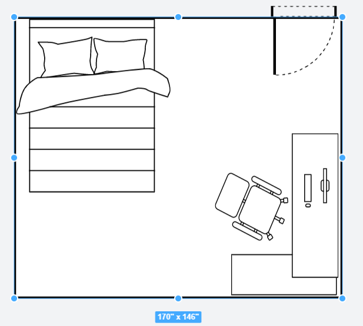

# Room-Arranger

## Docker Commands (run in root directory)

```
## Build
docker compose build

## May want to also remove all volumes/images/containers as well
```

```
## Run
docker compose up           ## Run Together
docker compose up frontend  ## Run Just Frontend 
docker compose up backend   ## Run Just Backend
```

Website: localhost:3000   
Backend: localhost:8000 (can directly test api here)   

## API Format

Notes: 
1. X and Y refer to the distance from the top left corner of the room to the top left corner of the object
2. X, Y, Width, Height are the values when the object has 0 rotation. If there is non-zero rotation, the resulting dimensions and position needs to be calculated.
3. Rotation values are in degrees in range [0, 360]. X, Y, Width, Height values are inches.
4. X and Y values might not correlate to the API values

This room layout exports the following JSON data



```
{
    "room": {
        "width": 168,
        "height": 144
    },
    "activeObjects": [
        {
            "itemKey": 51,
            "url": "vectors/structural/rightdoor.svg",
            "defaultWidth": 40,
            "defaultHeight": 40,
            "description": "Right Door",
            "category": "door",
            "type": "structural",
            "uid": "lflzfbjptur5tvd1mno",
            "z": 1,
            "width": 40,
            "height": 40,
            "rotate": 180,
            "x": 129,
            "y": -8.667
        },
        {
            "itemKey": 1,
            "url": "vectors/furniture/bed.svg",
            "defaultWidth": 80,
            "defaultHeight": 80,
            "description": "Full Bed",
            "category": "Bed",
            "type": "furniture",
            "uid": "lflzfo4ur5uenh6qtqe",
            "z": 2,
            "width": 80,
            "height": 90,
            "rotate": 0,
            "x": 0,
            "y": 0
        },
        {
            "itemKey": 2,
            "url": "vectors/furniture/desk.svg",
            "defaultWidth": 84,
            "defaultHeight": 64,
            "description": "L Desk",
            "category": "Desk",
            "type": "furniture",
            "uid": "lflzfzx7ihsoom9lv6a",
            "z": 3,
            "width": 84,
            "height": 64,
            "rotate": 270,
            "x": 93,
            "y": 69.333
        }
    ]
}
```